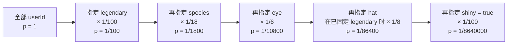
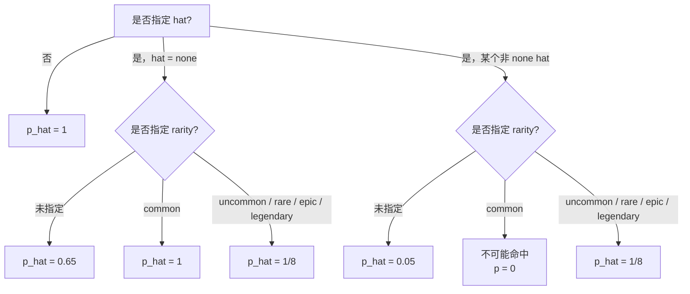

# Claude Buddy 算法说明

## 概要

本文档记录当前 `index.html` 中实现的 buddy 生成算法。
页面目前支持两种哈希模式：

- `Bun / Wyhash`，默认模式
- `Legacy / FNV-1a`，兼容旧版 HTML

当前默认的 `Bun / Wyhash` 模式，已经和本地 Bun `1.3.11` 做过对比验证；在已测试样本中，与 `Bun.hash()` 结果一致。

## 核心流程

给定一个 `userId`，buddy 的生成流程如下：

1. 拼接 `userId + SALT`
2. 对拼接后的字符串做哈希，得到 32-bit seed
3. 用该 seed 初始化 `mulberry32(seed32)`
4. 按固定顺序消费随机数：
   - `rarity`
   - `species`
   - `eye`
   - `hat`
   - `shiny`
   - `stats`

伪代码如下：

```js
const seed32 = hash(userId + SALT)
const rng = mulberry32(seed32)

const rarity = rollRarity(rng)
const species = pick(rng, SPECIES)
const eye = pick(rng, EYES)
const hat = rarity === 'common' ? 'none' : pick(rng, HATS)
const shiny = rng() < 0.01
const stats = rollStats(rng, rarity)
```

## 完整数据流图

下面这张 Mermaid 图，对应当前 `index.html` 的完整实现，覆盖：

- 外层搜索循环：生成候选 `userId`
- 内层生成流程：`userId -> hash -> seed -> rng -> buddy`
- 结果筛选：`matches()` 过滤并收集命中结果

```mermaid
flowchart TD
    A[UI / 配置输入] --> B[runSearch]

    A --> A1[筛选条件 state<br/>species / rarity / eye / hat / shiny]
    A --> A2[运行参数<br/>mode / hashAlgorithm / bytes / prefix / start / limit / count]

    B --> C{mode}
    C -->|random| D[generateRandomId(bytes)]
    C -->|sequential| E[userId = prefix + start + i]
    D --> F[userId]
    E --> F

    F --> G[rollUserId(userId, algorithm)]
    G --> H[userId + SALT]
    H --> I{hashAlgorithm}
    I -->|bun| J[wyhash64<br/>取低 32 位 seed]
    I -->|fnv| K[FNV-1a 32-bit<br/>直接作为 seed]
    J --> L[seed32]
    K --> L

    L --> M[mulberry32(seed32)]
    M --> N[rollFrom(rng)]

    N --> O[rollRarity(rng)]
    O --> P[rarity]
    P --> Q[species = pick(rng, SPECIES)]
    Q --> R[eye = pick(rng, EYES)]
    R --> S{rarity === common?}
    S -->|yes| T[hat = none<br/>不消耗 hat RNG]
    S -->|no| U[hat = pick(rng, HATS)]
    T --> V[shiny = rng() < 0.01]
    U --> V
    V --> W[rollStats(rng, rarity)]

    W --> W1[floor 由 rarity 决定]
    W1 --> W2[peak = pick(rng, STAT_NAMES)]
    W2 --> W3[dump = pick(rng, STAT_NAMES)<br/>若与 peak 相同则重抽]
    W3 --> W4[生成 5 个 stats 值]
    W4 --> X[bones = { rarity, species, eye, hat, shiny, stats }]

    X --> Y{matches(bones)}
    Y -->|no| Z[继续下一次尝试]
    Y -->|yes| AA[found.push({ userId, bones, attempts, hashAlgorithm })]
    AA --> AB{found.length >= count?}
    AB -->|yes| AC[停止搜索并输出结果]
    AB -->|no| Z
```

### RNG 消费顺序

生成流程依赖单条伪随机序列，消费顺序固定：

```text
seed32
  -> mulberry32(seed32)
  -> rarity
  -> species
  -> eye
  -> hat（仅当 rarity != common 时）
  -> shiny
  -> stats.peak
  -> stats.dump（若与 peak 相同会继续重抽）
  -> 5 个属性值
```

这意味着：

- `rarity === 'common'` 时，不会消耗一次帽子选择的 RNG
- 因而后续 `shiny` 和 `stats` 的随机序列位置会与非 `common` 情况不同
- 生成结果不仅取决于 seed，也取决于随机数的消费顺序

## 哈希算法

### 1. Bun / Wyhash

这是当前默认模式。

- 哈希族：Wyhash 64-bit
- 浏览器中的实现，按 Zig `std.hash.Wyhash` / Bun `Bun.hash()` 行为对齐
- 传给 `mulberry32` 的 seed，是 64-bit 哈希结果的低 32 位

等价思路：

```js
const seed32 = Number(Bun.hash(userId + SALT) & 0xffffffffn)
```

补充说明：

- `index.html` 里包含了浏览器侧的 Wyhash 实现
- 页面启动时会跑 Bun 文档中的自检向量

### 2. Legacy / FNV-1a

这是保留的兼容模式，对应更早的 HTML 版本。

- 哈希族：FNV-1a 32-bit
- 直接作为 `mulberry32` 的 seed 使用

伪代码：

```js
let h = 2166136261
for (let i = 0; i < s.length; i++) {
  h ^= s.charCodeAt(i)
  h = Math.imul(h, 16777619)
}
return h >>> 0
```

## 固定常量

### SALT

```txt
friend-2026-401
```

### Species

总共 18 个：

- `duck`
- `goose`
- `blob`
- `cat`
- `dragon`
- `octopus`
- `owl`
- `penguin`
- `turtle`
- `snail`
- `ghost`
- `axolotl`
- `capybara`
- `cactus`
- `robot`
- `rabbit`
- `mushroom`
- `chonk`

### Rarity

等级列表：

- `common`
- `uncommon`
- `rare`
- `epic`
- `legendary`

权重：

- `common: 60`
- `uncommon: 25`
- `rare: 10`
- `epic: 4`
- `legendary: 1`

对应概率：

- `common`: 60%
- `uncommon`: 25%
- `rare`: 10%
- `epic`: 4%
- `legendary`: 1%

### Eye

总共 6 个：

- `·`
- `✦`
- `×`
- `◉`
- `@`
- `°`

### Hat

总共 8 个：

- `none`
- `crown`
- `tophat`
- `propeller`
- `halo`
- `wizard`
- `beanie`
- `tinyduck`

关键规则：

- 如果 `rarity === 'common'`，则 `hat` 强制为 `none`
- 只有非 `common` 才会从帽子列表中继续随机

这意味着：

- `common` 不会额外消耗一次帽子选择的 RNG
- 所以后续的 `shiny` 和 `stats` 随机序列会随着 rarity 不同而发生偏移

### Shiny

规则：

```js
shiny = rng() < 0.01
```

所以 `shiny` 概率固定为 1%。

### Stats

属性名：

- `DEBUGGING`
- `PATIENCE`
- `CHAOS`
- `WISDOM`
- `SNARK`

rarity floor：

- `common: 5`
- `uncommon: 15`
- `rare: 25`
- `epic: 35`
- `legendary: 50`

生成逻辑：

1. 随机选一个 `peak` 属性
2. 随机选一个 `dump` 属性，且不能和 `peak` 相同
3. 对每个属性：
   - `peak`：高值
   - `dump`：低值
   - 其他属性：围绕 rarity floor 浮动

伪代码：

```js
if (name === peak) {
  value = Math.min(100, floor + 50 + Math.floor(rng() * 30))
} else if (name === dump) {
  value = Math.max(1, floor - 10 + Math.floor(rng() * 15))
} else {
  value = floor + Math.floor(rng() * 40)
}
```

## 页面暴露的搜索参数

当前页面支持这些筛选和运行参数：

- `species`
- `rarity`
- `eye`
- `hat`
- `shiny`
- `statsMin.DEBUGGING`
- `statsMin.PATIENCE`
- `statsMin.CHAOS`
- `statsMin.WISDOM`
- `statsMin.SNARK`
- `mode`
- `hashAlgorithm`
- `bytes`
- `prefix`
- `start`
- `limit`
- `count`

当前默认值：

- `rarity: 'legendary'`
- `shiny: 'any'`
- `mode: 'random'`
- `hashAlgorithm: 'bun'`
- `bytes: 32`
- `prefix: 'user-'`
- `start: 0`
- `limit: 5000000`
- `count: 1`

### Stats Min

页面支持为 5 个属性分别设置“最低值”筛选：

- `statsMin.DEBUGGING`
- `statsMin.PATIENCE`
- `statsMin.CHAOS`
- `statsMin.WISDOM`
- `statsMin.SNARK`

匹配规则：

```js
for (const [name, minValue] of Object.entries(state.statsMin)) {
  if (minValue == null) continue
  if (bones.stats[name] < minValue) return false
}
```

也就是说：

- 留空表示“不限制该属性”
- 填入数值后，该属性必须满足 `>= 最低值`
- 这是区间下界筛选，不是精确值匹配

### Mode

- `random`
  - 随机生成 hex 格式的 `userId`
  - 浏览器优先使用 `crypto.getRandomValues()`
- `sequential`
  - 按 `prefix + (start + i)` 生成 `userId`

## 概率直觉

一些常见组合的大致概率：

- 指定某个 `species`：约 `1 / 18`
- 指定 `legendary`：`1 / 100`
- `legendary + species`：约 `1 / 1800`
- `legendary + species + eye`：约 `1 / 10800`
- `legendary + species + eye + hat`：约 `1 / 86400`
- `legendary + species + eye + hat + shiny`：约 `1 / 8640000`

因此，高约束组合通常需要数百万次尝试才有较高命中概率。

### 搜索复杂度

从当前 `runSearch()` 的实现来看，搜索阶段没有剪枝、缓存、并行或反向构造 seed，而是逐个候选 `userId` 做完整判定。

复杂度可以拆成：

- 单次尝试
  - 生成 `userId`
    - `random`：约 `O(bytes)`
    - `sequential`：约 `O(len(prefix + index))`
  - 哈希 `userId + SALT`：约 `O(len(userId + SALT))`
  - `rollRarity / pick / rollStats / matches`：固定规模，约 `O(1)`
- 总体搜索
  - 时间复杂度：约 `O(limit * len(userId))`
  - 在默认 `bytes` 固定、字段数量固定时，可近似看作 `O(limit)`
  - 空间复杂度：约 `O(count)`，因为只保留命中的前 `count` 个结果

也就是说：

- **增加筛选条件，不会增加单次判定成本**
- **但会降低命中概率 `p`，从而线性拉高所需尝试次数**

### 命中概率公式

设单次尝试命中目标条件的概率为 `p`，尝试次数为 `N`：

- 期望命中数：`E[hits] = N * p`
- `N` 次内至少命中 1 次的概率：`P(hit >= 1) = 1 - (1 - p)^N`
- 想达到至少 `α` 的命中把握，所需尝试次数：

```text
n_α = ceil(log(1 - α) / log(1 - p))
```

- 如果目标是找到 `k` 个结果，则期望尝试次数约为：

```text
E[attempts for k hits] ≈ k / p
```

### 条件收缩图

下面这张图展示了一个典型高约束查询，命中概率如何逐层缩小：



这个图说明：

- 搜索成本的主要来源不是每次计算更贵，而是 `p` 被一层层乘小
- 只要多加一个低概率约束，整体搜索预算就会显著上升

### Hat 概率特殊分支图

`hat` 不是完全独立字段，因为 `common` 会强制 `hat = none`。
因此，`hat` 的边际概率取决于是否同时限制了 `rarity`。



对应原因：

- `hat = none` 的总体概率是：

```text
P(hat = none)
= P(common) + P(non-common) * P(none | non-common)
= 0.60 + 0.40 * (1/8)
= 0.65
```

- 任意某个非 `none` 帽子的总体概率是：

```text
P(specific non-none hat)
= P(non-common) * (1/8)
= 0.40 * (1/8)
= 0.05
```

### 搜索预算速查表

下表给出几组典型条件的：

- 单次命中概率 `p`
- 平均尝试次数 `1 / p`
- 达到 50% / 90% / 99% 至少命中 1 次所需的尝试次数

| 条件 | 单次命中概率 `p` | 平均尝试次数 `E=1/p` | 50% 把握 | 90% 把握 | 99% 把握 |
| --- | --- | ---: | ---: | ---: | ---: |
| 指定某个 `species` | `1/18` | 18 | 13 | 41 | 81 |
| 指定 `legendary` | `1/100` | 100 | 69 | 230 | 459 |
| `legendary + species` | `1/1800` | 1,800 | 1,248 | 4,144 | 8,288 |
| `legendary + species + eye` | `1/10800` | 10,800 | 7,486 | 24,867 | 49,734 |
| `legendary + species + eye + hat` | `1/86400` | 86,400 | 59,888 | 198,943 | 397,885 |
| `legendary + species + eye + hat + shiny` | `1/8640000` | 8,640,000 | 5,988,792 | 19,894,335 | 39,788,669 |
| `hat = none`（未指定 rarity） | `0.65` | 1.54 | 1 | 3 | 5 |
| 某个非 `none` 帽子（未指定 rarity） | `0.05` | 20 | 14 | 45 | 90 |

### 实际使用建议

- 如果只是想快速找到结果，优先只筛 `species` 或 `rarity`
- 如果加上 `eye`，通常仍可接受，但可能已经需要成千上万次尝试
- 如果再加 `hat`，尤其再叠加 `shiny`，就会进入数十万到数千万次级别
- 当目标是 `legendary + species + eye + hat + shiny` 这类组合时，默认 `limit = 5000000` 并不保证一定命中

## 验证结论

调试过程中确认过这些事实：

- 旧 HTML 和 Bun 不一致的根因，是旧版 HTML 使用了 FNV-1a，而不是 Bun 哈希
- `mulberry32`、rarity 抽取逻辑、属性生成顺序，本身不是 Bun/Node 差异的根因
- 当前 `Bun / Wyhash` 模式已经和本地 Bun `1.3.11` 对比验证
- 已测试样本中结果为 `0 mismatch`

## 关于早期脚本的结论

之前讨论过两类脚本：

- 一个简化的 Node 脚本，只覆盖 `rarity + species`
- 一个更接近完整逻辑的 Bun 脚本

最终结论：

- 简化 Node 脚本不是完整的 buddy 实现
- 如果目标是和 Bun 行为保持一致，应以 Bun 版本的思路为准
